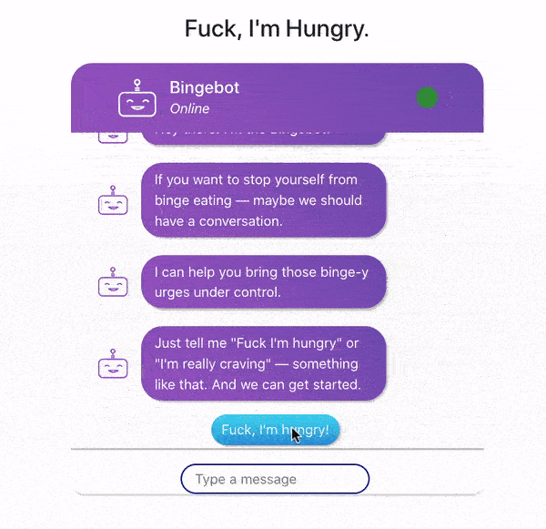
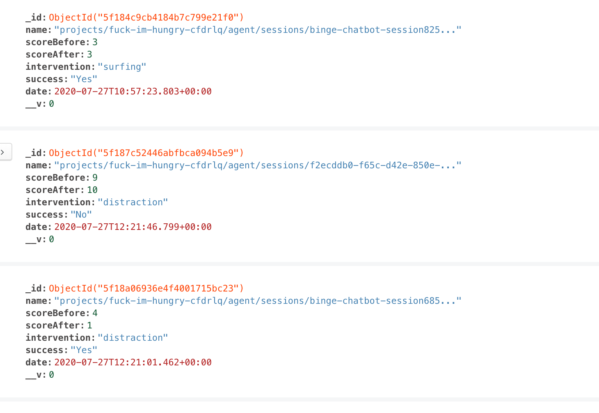
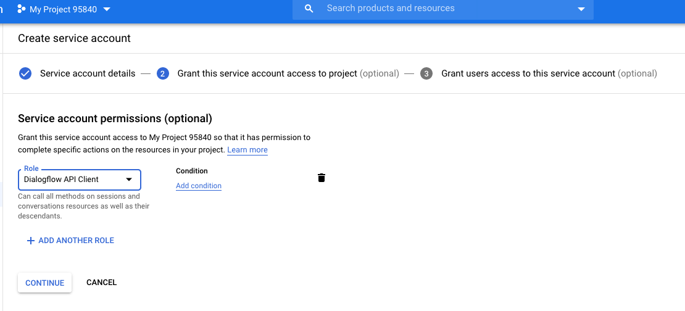
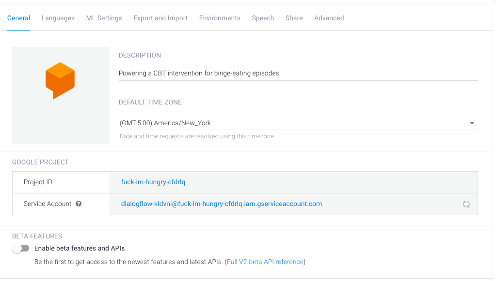
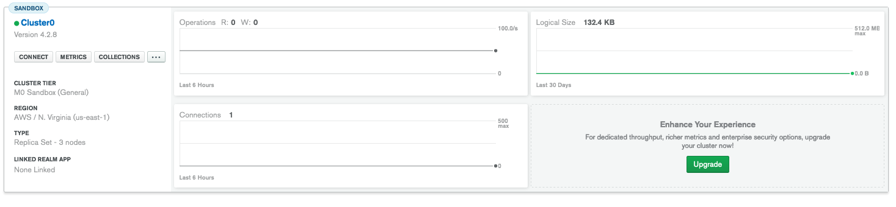

# Fuck, I'm Hungry. (Or, the Bingebot)

[Cognitive-behavioral therapy (CBT)](https://www.mayoclinic.org/tests-procedures/cognitive-behavioral-therapy/about/pac-20384610) for binge-eating issues, delivered via a chatbot.

Give it a whirl [here](https://seinwave.github.io/fuck-im-hungry).

<p align = "center">

</p>


## Rationale 

### Why binge-eating?

Many people struggle with binge-eating. It's a problem I wrestle with, myself. 

I thought a web-based intervention might be helpful for two reasons.

1. **It's a discrete behavior.**

The [emotions behind binge-eating](https://www.eatingdisorderhope.com/information/binge-eating-disorder) are complicated. They're murky, chronic, and tough to untangle. Not a great use-case for a chatbot. Fixing those emotional issues, if it's possible at all, is probably beyond the scope of any web app — more the domain of a human therapist, treating a patient for years.

But binge-eating *behaviors* are singular episodes. Which means they can be interrupted, delayed, or prevented, over the course of a single interaction. 

2. **Success is binary, and easy to observe.**

How do you tell if a person is 'over' the emotional issues behind their binge-eating? That's a million-dollar question. 

How do you tell if a person avoided a binge-eating episode? That's, uh, a much cheaper question. 

Did they binge eat, or did they not? Easy to tell if an intervention worked. 

### Why CBT?

First and foremost, because it works. 

This [meta-analysis](https://onlinelibrary.wiley.com/doi/abs/10.1002/eat.20696) (from Vocks, et al) found that CBT was the single best way to induce remission in binge-eating behaviors. This [overview](https://www.sciencedirect.com/science/article/abs/pii/S0193953X11000888?via%3Dihub) of treatments for binge-eating disorder calls CBT "the treatment of choice." 

It's the gold standard, by which all other therapies are measured.

(Crucially, it is *not* particularly effective at helping patients lose weight. That's a separate issue.)

[Some](https://www.ncbi.nlm.nih.gov/pmc/articles/PMC6914274/) [recent](https://ajp.psychiatryonline.org/doi/full/10.1176/appi.ajp.2019.19121256) [clinical trials](https://pubmed.ncbi.nlm.nih.gov/28960384/) even support *smart-phone based* CBT, as an effective intervention for binge-eating behaviors. Though there are some [questions](https://ajp.psychiatryonline.org/doi/full/10.1176/appi.ajp.2019.19121256) about how these studies have been designed. 


### Why a chatbot?

Two reasons.

1. **The form fits the function**

CBT is pretty active and demanding, as psychotherapies go. There are exercises to complete. There's usually some homework. Patients are advised to set aside a few hours a week to get all of this done. 

And much of this can happen *without the direct supervision of a therapist*. Lots of people, in fact, forgo therapists altogether — and get their CBT exercises from books or videos.

If that's the case, why not a chatbot?

The Bingebot essentially a way of shepherding users through these CBT exercises / homework assignments, without having to buy a book, or see a therapist.

**Note**: *I would never suggest that the Bingebot is a substitute for a qualified therapist. A human therapist offers guidance, feedback, insight, and reinforcement that an app could never emulate. The Bingebot is designed to be a convenient, user-friendly augmentation to a therapist's work.*

2. **"Stall me, please!"**

CBT comes with homework. Homework assignments are usually [worksheets](https://www.oxfordclinicalpsych.com/view/10.1093/med:psych/9780195334562.001.0001/med-9780195334562-appendix-10).

Nothing wrong with that. People get a lot of value from them. I certainly have. 

But, worksheets are also inert. They can be a little boring, or disengaging. If you're trying to battle a powerful urge to eat, a worksheet might not be able to hold your attention.

A chatbot is different. It invites interaction. A little bit of play, even. And the ten minutes you spend messing around with the Bingebot are ten minutes that you're *not* binge-eating. 

That can make all the difference! Ten minutes may be just enough time for a binge-eating urge to peak, and pass. 

It's not just the CBT exercises that make the Bingebot useful. It's the 'stalling factor' that comes from interacting with the bot itself. 

## Execution

But enough whys and wherefores. Let's talk tech. 

### What's your stack?

The heart and soul of the Bingebot is a `DialogFlow` agent. 

It handles user's inputs, spits appropriate outputs back.

These outputs, in turn, are (mostly) handled by a `Node.js` server, which routes the DF agent's responses to a `React`-based frontend.

But, `DialogFlow` has no "memory", per se. It can't hold user's responses from, say, six interactions previous. Which means it can't help the user judge if a binge-eating session was successful.

So, a simple `MondoDB` database serves as the Bingebot's memory. It retains only anonymous, user-generated input — the `Before` score of binge-urge intensity; the `After` score; the `Choice of Intervention`; the `Date`; whether the `Intervention was Successful` and the `Unique Name` for the Bingebot session. 

Like so: 
<p align = "center">

</p>


### Where'd you get your info?

From James E. Mitchell's* ['CBT for Binge-Eating Disorders Self-Help Manual'](https://www.naadac.org/assets/2416/mitchell-cbt-for-bed-self-help-manual.pdf). Generously made available by [NAADAC, the Association for Addiction Professionals](https://www.naadac.org/about). (That's the proper name of the organization — acronym + subtitle. A little confusing, if you ask me.)

<p align = "center">

</p>

Dude literally wrote the book on the subject. 

**Note:** *This is not — I repeat, NOT — the same [James E. Mitchell](https://en.wikipedia.org/wiki/James_Elmer_Mitchell#Work_as_a_CIA_contractor_on_interrogation_practices) who did all that waterboarding for the CIA!*

## Clone this app!

If you have ideas to improve the Bingebot, by all means, fork the repo.

If you want to work with a local copy, clone this repo to your home machine. Then make sure to install the following dependencies (`npm install` / `yarn add` should work for all of them):

- [compromise](https://github.com/spencermountain/compromise)
    - And its extension, compromise-numbers 
    - For capturing user input that doesn't *quite* fit the mold
- body-parser
- concurrently
- dialogflow
- dialogflow-fulfillment
- express
- mongoose

You'll also need to configure your ENV variables to make this work.

Which means you'll need to GET some ENV variables. 

This means a little bit of tedious services set-up. 

### Google / DialogFlow
- Craete a new project on the [Google Cloud Platform](https://cloud.google.com/).
- To that project, add a new service account, with DialogFlow client permissions. Like so: 
<p align = "center">

</p>

- **IMPORTANT** When you create that account, make sure to create a *new private key* (as a JSON) to go along with it.
    - Then, once you've saved the key to a directory on your machine, you will need to use the command-line to *export* the key to Google. 
    - Navigate your CLI to the Bingebot's root directory. Then type in the following command:

    ```
    export GOOGLE_APPLICATION_CREDENTIALS=/path_to_your_JSON_key/key-file.json
    ```
    - Your API will not be able to communicate with DialogFlow without this! (I wasted a lot of time not knowing this. I'm trying to spare you some pain.)

- Head to [DialogFlow](dialogflow.cloud.google.com/), and create a new agent.
- Connect your DialogFlow agent to your services account. Like so: 
<p align = "center">

</p>

- Then, you'll use the DialogFlow UI to import the Bingebot agent ZIP file. 


### MongoDB
- Head to [MongoDB Atlas](https://www.mongodb.com/cloud/atlas), and create an account. (Don't worry it's free).
- Create a new Cluster
- Hit "Connect", seen here:
<p align = "center">

</p>

- And choose "Connect Using MongoDB compass" to get your Mongo URI string. 
- (Or, of course, you can use the DB of your choice.)


